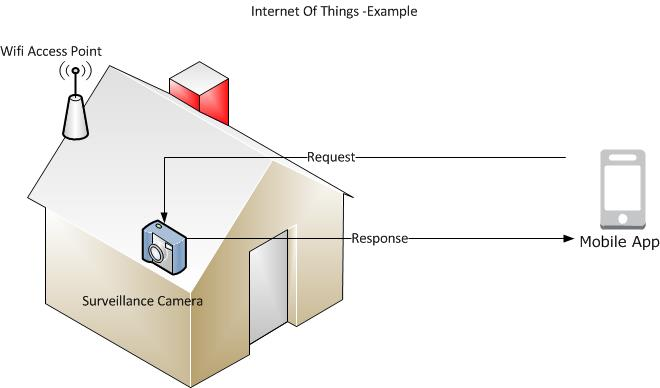
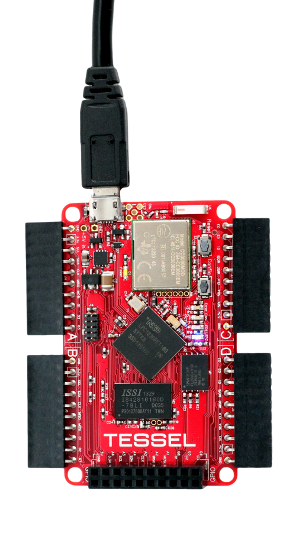
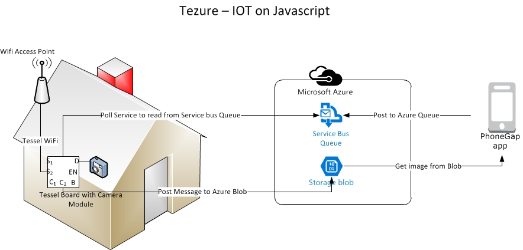

# TEZURE
 > Cost effective IOT apps using Javascript, Tessel & Azure

Internet Of Things (IOT)
------------------------

> The Internet of Things (IoT) is the interconnection of uniquely identifiable embedded computing devices within the existing Internet infrastructure

> Every Industry is getting Smarter
 - Smart Logistics
 - Smart Home
 - Smart Industries
 - Smart Healthcare
 - Smart Entertainment

With number of internet connected devices is exploding, there is a need for enabling and controlling services remotely.


Why IOT
-------

- Enabling services remotely
- More targeted services
- Data driven insights
- Cost efficient


Tezure - SpyCam
===============

- Mobile controlled Surveillance Camera


Complexities
------------
- Design & Build
	- C, C++ for Sensors/Devices
	- C#, JAVA for cloud services
	- C#, Java, Obj C for Mobile devices
- Connectivity (IP & Non IP devices)
- Security - Identity and Authorization
- Scalability


Keep it simple
--------------
- Cost efficient
- End to End solutions using pure Javascript
	- Tessel based devices/sensors
	- X platform mobile apps using Cordova/PhoneGap

- REST based access to Azure Service bus/Azure Blobs 


Demo
----
<h3>Tezure - SpyCam Demo</h3>
[](http://www.youtube.com/watch?v=MZK7aLQwSCE)

Hello Tessel!
-------------

- Tessel is a microcontroller that runs JavaScript. 
- It's Node-compatible and ships with Wifi built in. 
- Its easier than ever make physical devices that connect to the web.
- Bridges the gap between Embedded devices and Web development

What Azure Offers
------------------
- Azure Service bus
	- Queues, Topics, relays for messaging
	- Mobile services for push notifications and data tables
- Azure store blobs
	- Images and Video storage
- SAS (Shared Access Token) based authentication via REST
- Supports Async access using NodeJS/Javascript 


What PhoneGap Offers
--------------------
- PhoneGap is a free and open source framework that allows you to create X-Plat mobile apps using Web technologies
- Mobile Apps can be created using HTML, Javascript and CSS
- PhoneGap Build takes the pain out of compiling PhoneGap apps. Get app-store ready apps without the headache of maintaining native SDKs. 

Tezure SpyCam - Architecture
----------------------------


- Tessel
  ------
	-Tessel setup consists of Tessel Microcontroller and Camera module
	-Nodejs packages can be installed inside the tessel devices
	-Current set up consists of tesselPollingService() function which continously checks for new message on Azure queue
	-On new message, Camera  module takes a picture and uploads to Azure blob storage
	-'Tesselate' NPM module is used to load the Camera Module functions.
	-'Async' NPM module is used to process the Polling cycles asynchronously

	````javascript
		 require('tesselate')(['camera-vc0706'], function (tessel, modules) {
            console.log("Executed action 2 : After Camera Load : cycle no :  " + count );
             async.auto({
                listen_messages: function (callback) {
                    var options = {...
    ````
    [Source Code](Tezure.Tessel/index.js)

- Azure service bus
  -----------------
	- Azure queue receives messages from the Mobile applications and authenticated via SAS token
	- Azure Blob storage receives Images from tessel devices and authenticated via SAS
	- CORS rules can be added to Azure storage to enable X-domain requests

- PhoneGap App
  ------------
	- Sends a surveillance request message with Device ID and time stamp
	- Polls the Azure Storage to retreive image with DeviceID and time stamp
	- Built with end to end javascript 
	[Source Code](Tezure.PhoneGap\tezure\www\index.html)

PreRequisites
-------------
- Tessel Board + camera module ($125) [Tessel Shop](https://shop.tessel.io/) 
- Wifi connectivity
- Azure Subscription
	- Service bus Queues - $10/mo (12.5 Million Ops) [Service Bus Pricing](http://azure.microsoft.com/en-us/pricing/details/service-bus/) 
	- Blob storage - $0.024 per GB  [Storage Pricing](http://azure.microsoft.com/en-us/pricing/details/storage/) 
- Mobile Device


Few Gotcha's
-------------
- SAS token for Service bus queue is generated using [Red Dog Tools](https://github.com/sandrinodimattia/RedDog/releases/tag/0.2.0.1)
- SAS token for Azure storage is generated using [Service Bus Explorer](https://code.msdn.microsoft.com/windowsapps/Service-Bus-Explorer-f2abca5a)
- Enable CORS rules for Storage using [Synapta CORS helper](http://blog.cynapta.com/2013/12/cynapta-azure-cors-helper-free-tool-to-manage-cors-rules-for-windows-azure-blob-storage/)